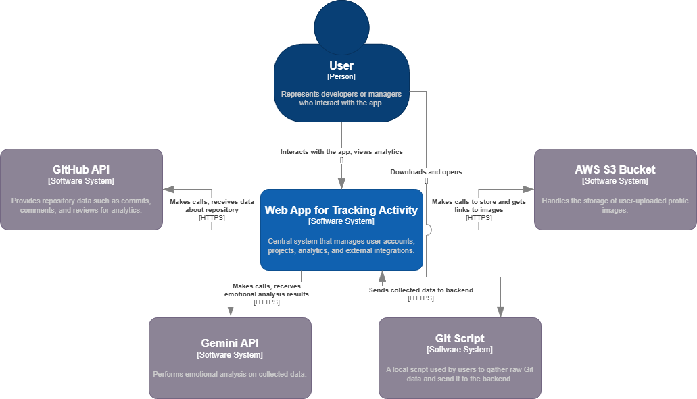
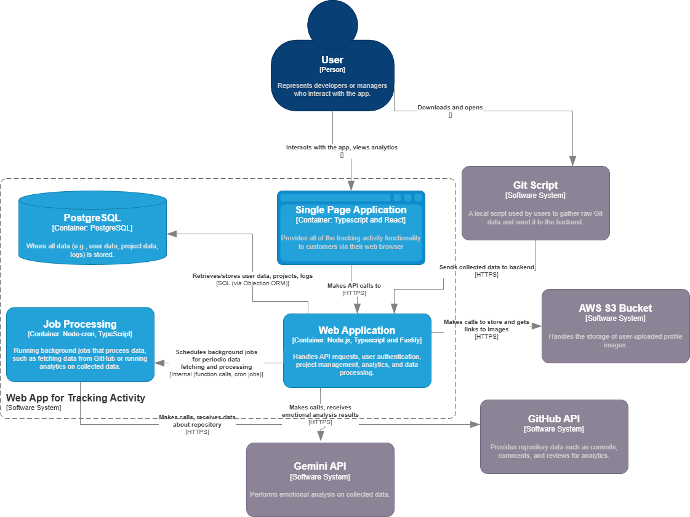
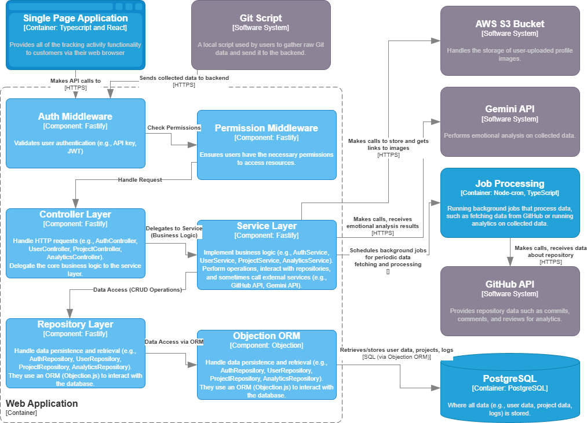

# RepoTrackr

Web application for collecting and analyzing developers activity via Git Script and Github API.

## 1. Architecture

### 1.1 Global

#### 1.1.1 Technologies

1. Typescript
2. npm workspaces

### 1.2 Frontend

#### 1.2.1 Technologies

1. React
2. Redux + Redux Toolkit
3. React Hook Form
4. React Router

#### 1.2.2 Folder Structure

1. assets - static assets (images, global styles, fonts)
2. libs - shared libraries and utilities
3. modules - separate app features or functionalities
4. pages - app pages

### 1.3 Backend

#### 1.3.1 Technologies

1. Fastify
2. Knex + Objection
3. Node-CRON
4. Pino
5. Bcrypt

#### 1.3.2 Folder Structure

1. db - database migrations
2. libs - shared libraries and utilities
3. modules - separate app features or functionalities

### 1.4 Shared Package

#### 1.4.1 Technologies

1. Zod

## 2. How to Run

### 2.1 Manually

1. Fill .env files:

- apps/frontend/.env
- apps/backend/.env

2. Install dependencies: `npm install`.

3. Build shared: `npm run build:shared`

4. Apply migrations: `npm run migrate:dev -w apps/backend`

5. Run backend: `npm run start:dev -w apps/backend`

6. Run frontend: `npm run start:dev -w apps/frontend`
